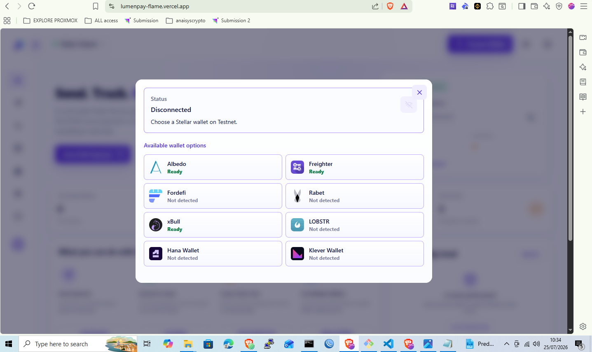
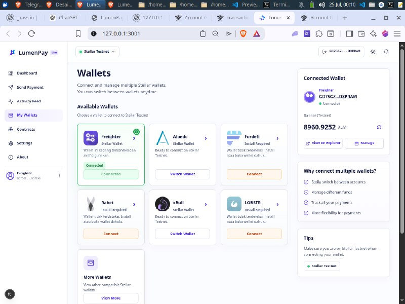
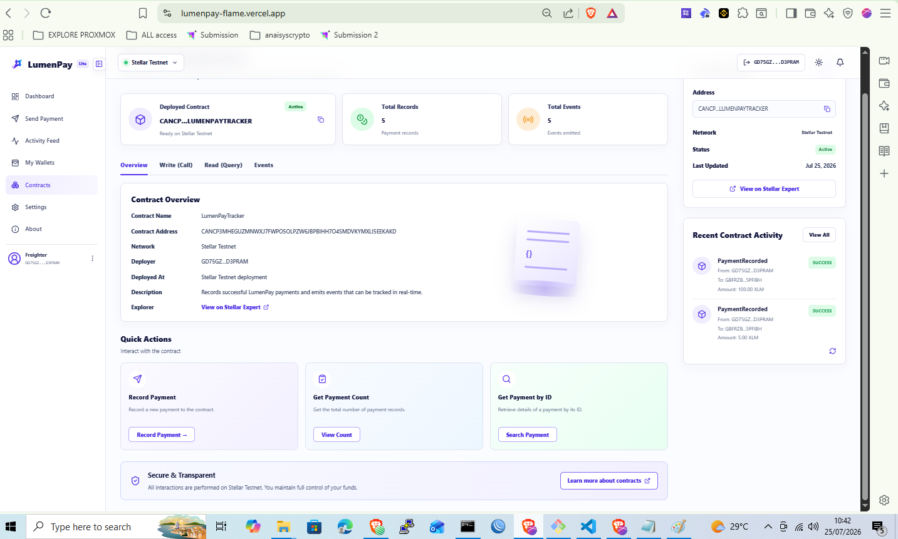
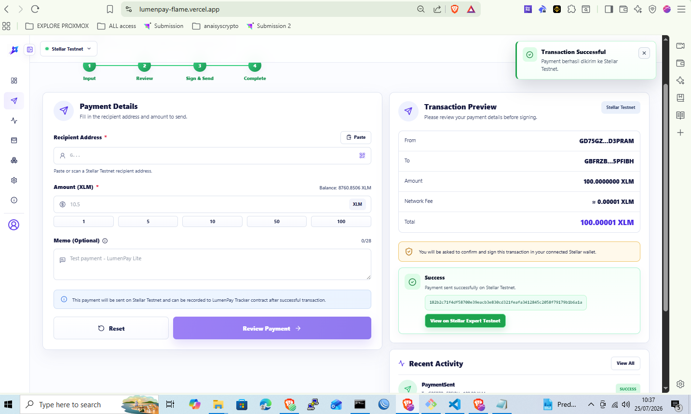
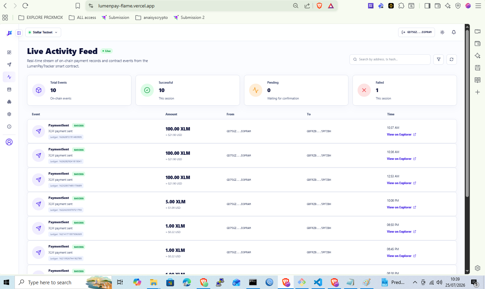
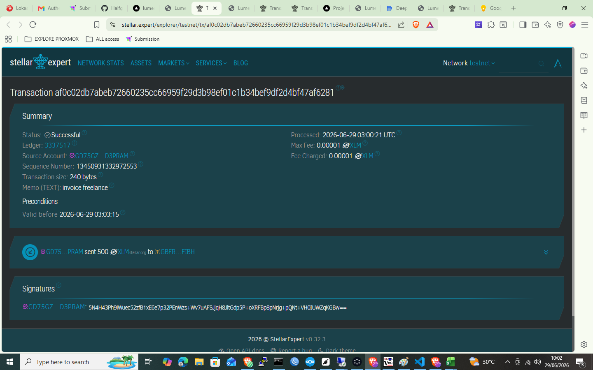
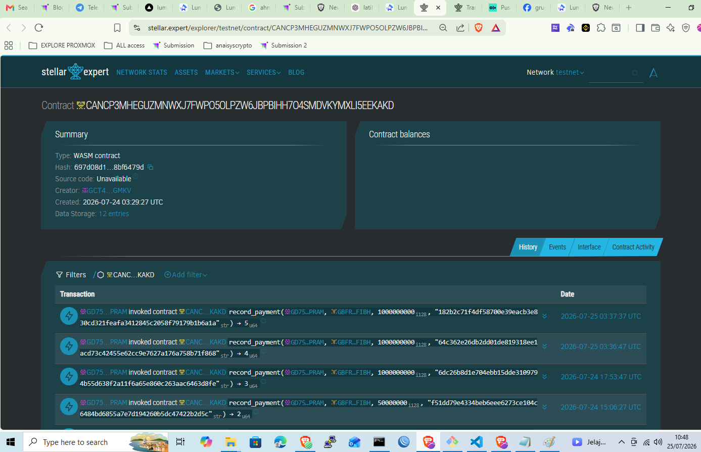

# LumenPay Lite

LumenPay Lite is a multi-wallet Stellar Testnet payment tracker built for the Yellow Belt Level 2 challenge.

The app lets users connect a Stellar wallet, check Testnet XLM balance, send native XLM, record successful payments through a Soroban smart contract, and monitor contract events in a live activity feed.

Version history is available in [CHANGELOG.md](CHANGELOG.md). The detailed submission guide is available in [YELLOW_BELT_STEP_BY_STEP.md](YELLOW_BELT_STEP_BY_STEP.md).

## Live Demo

[Open LumenPay Lite](https://lumenpay-flame.vercel.app/)

## Yellow Belt Scope

### Yellow Belt Level 1

- Wallet connection
- Balance display
- Send XLM
- Transaction result
- Explorer link

### Yellow Belt Level 2

- Multi-wallet support
- Soroban contract deployment
- Frontend contract call
- Live activity feed
- Transaction status pending/success/failed
- Error handling

## Features

- Multi-wallet connection with StellarWalletsKit
- Wallet chooser with availability detection
- Persistent wallet session after page refresh
- Stellar Testnet network guard
- Connected public key display
- XLM balance lookup through Horizon Testnet
- Native XLM Testnet payment form
- Recipient address validation
- QR recipient scanning
- Transaction preview before signing
- Wallet-agnostic signing flow
- Transaction status: Pending, Submitting, Success, and Failed
- Clear wallet-not-found, rejected-signature, and insufficient-balance errors
- `LumenPayTracker` Soroban contract with persistent read/write storage
- Contract call after a successful payment
- Live contract event synchronization every 6 seconds
- Stellar Expert Testnet explorer links
- Responsive desktop and mobile layout

## Tech Stack

- Next.js
- React
- TypeScript
- Tailwind CSS
- Stellar SDK
- StellarWalletsKit
- Soroban Rust SDK

## Requirements

- Node.js 20+
- npm
- Rust and Cargo, only required for contract development/testing
- Stellar CLI, only required for contract build/deployment
- A supported Stellar wallet such as Freighter, xBull, Albedo, Rabet, or another wallet detected by StellarWalletsKit
- Wallet set to Stellar Testnet
- Testnet XLM balance

If the account has no Testnet XLM, fund it with Stellar Friendbot.

## Quick Start

### 1. Clone the repository

```bash
git clone https://github.com/Gusma-crypto/lumenpay.git
cd lumenpay
```

### 2. Install dependencies

```bash
npm install
```

### 3. Create the environment file

Create `.env.local` in the project root:

```bash
cp .env.example .env.local
```

If `.env.example` is not available, create `.env.local` manually:

```env
NEXT_PUBLIC_STELLAR_NETWORK=testnet
NEXT_PUBLIC_HORIZON_URL=https://horizon-testnet.stellar.org
NEXT_PUBLIC_SOROBAN_RPC_URL=https://soroban-testnet.stellar.org
NEXT_PUBLIC_TRACKER_CONTRACT_ID=CANCP3MHEGUZMNWXJ7FWPO5OLPZW6JBPBIHH7O4SMDVKYMXLI5EEKAKD
```

### 4. Run the development server

```bash
npm run dev
```

Open the app:

```txt
http://127.0.0.1:3001
```

### 5. Build for production

```bash
npm run build
```

### 6. Run validation checks

```bash
npm run lint
npx tsc --noEmit
```

For the Soroban contract:

```bash
cd contracts
cargo test
cd ..
```

## How to Use the App

### 1. Connect a wallet

1. Open `http://127.0.0.1:3001`.
2. Click `Connect Wallet`.
3. Choose an available Stellar wallet.
4. Approve the connection in the wallet extension or wallet app.
5. Make sure the wallet is using Stellar Testnet.

If the selected wallet is not installed or not detected, the app shows a wallet-not-found notification and does not crash.

### 2. Check balance

1. Open the `My Wallets` page.
2. Confirm the connected public key is displayed.
3. Confirm the Testnet XLM balance is visible.
4. Use the refresh button if the balance was recently funded.

### 3. Send XLM

1. Open the `Send Payment` page.
2. Enter a recipient Stellar public key.
3. Enter the XLM amount.
4. Optionally enter a memo.
5. Click review.
6. Review the payment details in the popup.
7. Approve the payment transaction in your wallet.

The transaction status moves through:

```txt
Pending...
Submitting...
Success
```

If the transaction fails, the app shows `Failed` with an error message.

### 4. Record the payment on the contract

After a successful XLM payment, the frontend prepares a `record_payment` contract call.

1. Approve the second wallet signature for `record_payment`.
2. Wait for the contract call status to complete.
3. Copy the contract call hash from the UI or Activity Feed.
4. Open the hash in Stellar Expert Testnet to verify it.

### 5. View activity

1. Open the `Activity Feed` page.
2. The app syncs contract events every 6 seconds.
3. Use search to filter by address, transaction hash, amount, or event type.
4. Open event hashes in Stellar Expert Testnet.

### 6. Manage settings

The `Settings` page includes wallet profile, application preferences, display options, security preferences, and local data clearing.

Wallet sessions are persisted in browser storage. Refreshing the page keeps the wallet shown as connected until the user disconnects or clears local data.

## Smart Contract

The contract source and tests are in `contracts/lumenpay_tracker`.

The contract exposes:

```txt
record_payment(sender, recipient, amount, payment_hash)
get_payment(id)
get_payment_count()
```

`record_payment` requires sender authorization, stores the record, prevents duplicate payment hashes, and emits a payment event.

Build, test, and deploy instructions are available in [contracts/README.md](contracts/README.md).

## Contract Evidence

Deployment values are intentionally not fabricated.

| Evidence | Value |
| --- | --- |
| Testnet contract ID | [`CANCP3MHEGUZMNWXJ7FWPO5OLPZW6JBPBIHH7O4SMDVKYMXLI5EEKAKD`](https://stellar.expert/explorer/testnet/contract/CANCP3MHEGUZMNWXJ7FWPO5OLPZW6JBPBIHH7O4SMDVKYMXLI5EEKAKD) |
| Deployment transaction | [`7f008a367ad0f3cc6ca6bf27dbc69adab452a9338e0866a05599ae4089f7d0bb`](https://stellar.expert/explorer/testnet/tx/7f008a367ad0f3cc6ca6bf27dbc69adab452a9338e0866a05599ae4089f7d0bb) |
| Successful CLI `record_payment` validation | [`21e5d6d77dd9a8d55445717e7222b44944e6095fe01a458dec72d5068cabce35`](https://stellar.expert/explorer/testnet/tx/21e5d6d77dd9a8d55445717e7222b44944e6095fe01a458dec72d5068cabce35) |
| Successful frontend `record_payment` | Pending frontend wallet evidence. Replace this with the transaction hash produced after sending a payment from the app and approving the `record_payment` wallet signature. |

The CLI validation hash proves the deployed contract can execute `record_payment`. The frontend evidence must use a separate transaction hash from the browser wallet flow, not the deployment hash or the CLI validation hash.

## Project Structure

```txt
app/
  page.tsx
  layout.tsx
  globals.css

components/
  AppHeader.tsx
  AppSidebar.tsx
  WalletPanel.tsx
  PaymentForm.tsx
  TransactionStatus.tsx
  LiveContractActivity.tsx
  AddressBook.tsx

lib/
  wallets.ts
  contract.ts
  stellar.ts
  explorer.ts
  validation.ts

public/
  favicon.svg
  logo.png
  screenshots/

contracts/
  lumenpay_tracker/
```

## Screenshots

Level 2 evidence screenshots:

| Requirement | File |
| --- | --- |
| Wallet options (StellarWalletsKit) | [`public/screenshots/level2-wallet-options.png`](public/screenshots/level2-wallet-options.png) |
| Multi-wallet connected | [`public/screenshots/level2-wallet-connected.jpeg`](public/screenshots/level2-wallet-connected.jpeg) |
| Smart contract deployed | [`public/screenshots/contracts.png`](public/screenshots/contracts.png) |
| Contract call success | [`public/screenshots/level2-contract-call.png`](public/screenshots/level2-contract-call.png) |
| Read contract data | [`public/screenshots/contracts.png`](public/screenshots/contracts.png) |
| Transaction status (Pending → Success → Failed) | [`public/screenshots/level2-transaction-status.png`](public/screenshots/level2-transaction-status.png) |
| Live activity feed | [`public/screenshots/level2-live-feed.png`](public/screenshots/level2-live-feed.png) |
| Contract event synchronization | [`public/screenshots/level2-live-feed.png`](public/screenshots/level2-live-feed.png) |
| Stellar Explorer verification | [`public/screenshots-yellow-belt1/explore.png`](public/screenshots-yellow-belt1/explore.png) |
| Contract Explorer verification | [`public/screenshots/contract-explore.png`](public/screenshots/contract-explore.png) |

### Evidence Preview
















## Useful Links

- Repository: https://github.com/Gusma-crypto/lumenpay.git
- Live demo: https://lumenpay-flame.vercel.app/
- LumenPayTracker contract: https://stellar.expert/explorer/testnet/contract/CANCP3MHEGUZMNWXJ7FWPO5OLPZW6JBPBIHH7O4SMDVKYMXLI5EEKAKD
- Stellar Testnet Horizon: https://horizon-testnet.stellar.org
- Stellar Expert Testnet: https://stellar.expert/explorer/testnet
- Stellar Friendbot: https://friendbot.stellar.org
- Stellar Developers: https://developers.stellar.org
- Freighter: https://www.freighter.app

## Troubleshooting

### Wallet is not detected

Install or open the selected wallet, unlock it, and refresh the page.

### Wallet is on the wrong network

Switch the connected wallet to Stellar Testnet.

### Account has no balance

Fund the account with Friendbot, then refresh the balance in the app.

### Transaction fails

Check that the recipient address is valid, the amount is greater than zero, the wallet has enough Testnet XLM, and the wallet is still on Stellar Testnet.

### Port 3001 is already in use

Stop the existing dev server or run the app on a different port.

## Submission Checklist

- [x] Public GitHub repository
- [x] README in English
- [x] Project description
- [x] Setup instructions from clone to run
- [x] Usage guide
- [x] Wallet connected screenshot
- [x] Balance displayed screenshot
- [x] Successful Testnet transaction screenshot
- [x] Transaction result screenshot
- [x] Transaction result shown in the UI
- [x] Transaction hash shown in the UI
- [x] Stellar Expert Testnet link shown in the UI
- [x] StellarWalletsKit multi-wallet options
- [x] Soroban contract source and unit tests
- [x] Frontend contract read/write integration
- [x] Live contract event polling
- [x] Payment and contract pending/success/fail states
- [x] Deployed `LumenPayTracker` Testnet contract ID
- [x] Verifiable CLI contract call transaction hash
- [ ] Frontend wallet `record_payment` transaction hash
- [x] Level 2 submission screenshots
- [x] Live demo URL

## Final Submission Steps

Before submitting Yellow Belt Level 2:

1. Run the app locally or open the deployed site.
2. Connect a Stellar Testnet wallet.
3. Send a Testnet XLM payment from the app.
4. Approve the second wallet signature for `record_payment`.
5. Copy the frontend `record_payment` transaction hash into the contract evidence table.
6. Capture the pending Level 2 screenshots listed above.
7. Verify that the live demo and contract Explorer links open correctly.
8. Commit and push the final README and screenshot updates.
