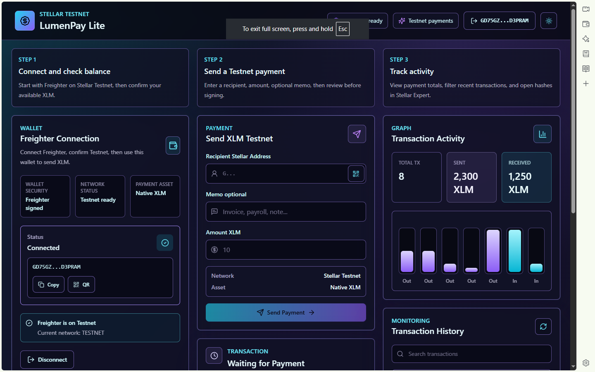
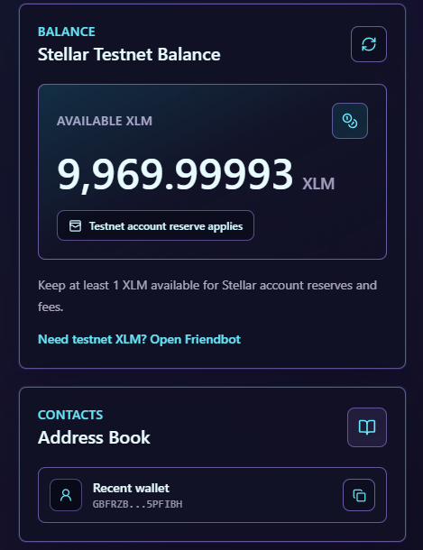
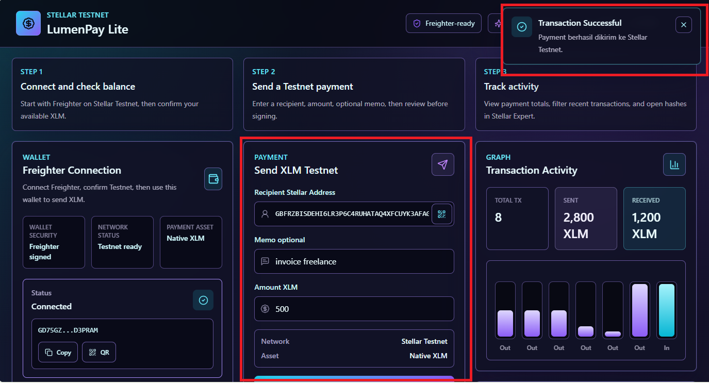
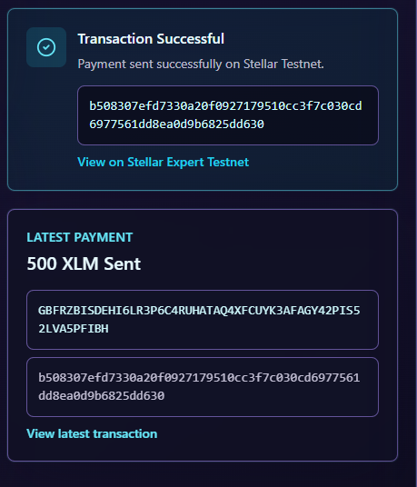

# LumenPay Lite

A multi-wallet Stellar Testnet payment tracker for the Level 2 Yellow Belt challenge.

LumenPay Lite lets a user connect a supported Stellar wallet, send a native XLM payment, record it through a Soroban contract, and follow the resulting contract events in a synchronized activity feed.

Panduan lengkap deployment, testing, pengambilan bukti, commit, dan submission tersedia di [`YELLOW_BELT_STEP_BY_STEP.md`](YELLOW_BELT_STEP_BY_STEP.md).


## Features

* Multi-wallet connection with StellarWalletsKit
* Wallet chooser with availability detection
* Stellar Testnet network guard
* Connected public key display
* XLM balance lookup through Horizon Testnet
* Native XLM testnet payment form
* Recipient address validation
* QR recipient scanning
* Transaction preview before signing
* Wallet-agnostic signing flow
* Pending, success, and failed transaction states
* Clear wallet-not-found, rejected-signature, and insufficient-balance errors
* `LumenPayTracker` Soroban contract with persistent read/write storage
* Contract call after a successful payment
* Live contract-event synchronization every 6 seconds
* Stellar Expert testnet explorer link

## Tech Stack

* Next.js
* React
* TypeScript
* Tailwind CSS
* Stellar SDK
* StellarWalletsKit
* Soroban Rust SDK

## Getting Started

Clone the repo:

```bash
git clone https://github.com/Gusma-crypto/lumenpay.git
cd lumenpay
```

Install dependencies:

```bash
npm install
```

Create the local environment file:

```bash
cp .env.example .env.local
```

Run the app:

```bash
npm run dev
```

Open:

```txt
http://localhost:3001
```

## Environment

```env
NEXT_PUBLIC_STELLAR_NETWORK=testnet
NEXT_PUBLIC_HORIZON_URL=https://horizon-testnet.stellar.org
NEXT_PUBLIC_SOROBAN_RPC_URL=https://soroban-testnet.stellar.org
NEXT_PUBLIC_TRACKER_CONTRACT_ID=C...
```

## Requirements

* Node.js 20+
* npm
* At least one supported Stellar wallet (for example Freighter, xBull, Albedo, or Rabet)
* Wallet set to Stellar Testnet
* Testnet XLM balance

If the account is not funded yet, use the Friendbot link shown in the app.

## How to Test

1. Open the app.
2. Choose an available wallet.
3. Make sure the wallet is on Stellar Testnet.
4. Confirm the XLM balance is displayed.
5. Enter a recipient Stellar public key.
6. Enter an XLM amount.
7. Review the transaction preview.
8. Approve the transaction in Freighter.
9. Check the transaction result in the app.
10. Open the Stellar Expert testnet link to verify the transaction.
11. Approve the second signature to record the successful payment in `LumenPayTracker`.
12. Confirm the contract call status and new live activity event.

## Smart Contract

The contract source and tests are in `contracts/lumenpay_tracker`. It exposes:

```txt
record_payment(sender, recipient, amount, payment_hash)
get_payment(id)
get_payment_count()
```

`record_payment` requires sender authorization, stores the record, and emits a `payment` event. Build, test, and deploy instructions are in [`contracts/README.md`](contracts/README.md).

Deployment values are intentionally not fabricated:

| Evidence | Value |
| --- | --- |
| Testnet contract ID | `CANCP3MHEGUZMNWXJ7FWPO5OLPZW6JBPBIHH7O4SMDVKYMXLI5EEKAKD` |
| Deployment transaction | [`7f008a367ad0f3cc6ca6bf27dbc69adab452a9338e0866a05599ae4089f7d0bb`](https://stellar.expert/explorer/testnet/tx/7f008a367ad0f3cc6ca6bf27dbc69adab452a9338e0866a05599ae4089f7d0bb) |
| Successful `record_payment` validation | [`21e5d6d77dd9a8d55445717e7222b44944e6095fe01a458dec72d5068cabce35`](https://stellar.expert/explorer/testnet/tx/21e5d6d77dd9a8d55445717e7222b44944e6095fe01a458dec72d5068cabce35) |
| Successful frontend `record_payment` | Run through the connected wallet and add its hash before final submission |

The frontend remains fully usable for regular XLM payments when no contract ID is configured; the contract panel clearly shows `Awaiting deployment`.

## Project Structure

```txt
app/
  page.tsx
  layout.tsx
  globals.css

components/
  WalletPanel.tsx
  BalanceCard.tsx
  PaymentForm.tsx
  TransactionStatus.tsx
  TransactionHistory.tsx
  LiveContractActivity.tsx
  AddressBook.tsx

lib/
  wallets.ts
  contract.ts
  stellar.ts
  explorer.ts
  validation.ts

public/
  screenshots/

contracts/
  lumenpay_tracker/
```

## Screenshots

Add the final submission screenshots here:

| Requirement | File |
| --- | --- |
| Wallet connected state | `public/screenshots/wallet-connected.png` |
| Balance displayed | `public/screenshots/balance-displayed.png` |
| Successful testnet transaction | `public/screenshots/transaction-success.png` |
| Transaction result shown to the user | `public/screenshots/transaction-result.png` |
| Explore Hash  | `public/screenshots/explore.png` |
| Level 2 wallet options | `public/screenshots/level2-wallet-options.png` |
| Level 2 contract call | `public/screenshots/level2-contract-call.png` |
| Level 2 live feed | `public/screenshots/level2-live-feed.png` |
| Level 2 transaction states | `public/screenshots/level2-transaction-status.png` |










## Useful Links

* Repository: https://github.com/Gusma-crypto/lumenpay.git
* Stellar Testnet Horizon: https://horizon-testnet.stellar.org
* Stellar Expert Testnet: https://stellar.expert/explorer/testnet
* Freighter: https://www.freighter.app

## Troubleshooting

### A wallet is not detected

Install or open the selected wallet, unlock it, and refresh the page.

### Wrong network

Switch the connected wallet to Stellar Testnet.

### Account has no balance

Fund the account with Friendbot, then refresh the balance.

### Transaction fails

Check that the recipient address is valid, the amount is greater than zero, the wallet has enough testnet XLM, and Freighter is still on Testnet.

## Submission Checklist

- [x] Public GitHub repository
- [x] `README.md`
- [x] Project description
- [x] Setup instructions
- [ ] Screenshot: wallet connected state
- [ ] Screenshot: balance displayed
- [ ] Screenshot: successful testnet transaction
- [ ] Screenshot: transaction result shown to the user
- [x] Transaction result shown in the UI
- [x] Transaction hash shown in the UI
- [x] Stellar Expert testnet link shown in the UI
- [x] StellarWalletsKit multi-wallet options
- [x] Soroban contract source and unit test
- [x] Frontend contract read/write integration
- [x] Live contract-event polling
- [x] Payment and contract pending/success/fail states
- [x] Deploy `LumenPayTracker` to Testnet and set its contract ID
- [x] Add a verifiable contract call transaction hash
- [ ] Capture Level 2 submission screenshots
